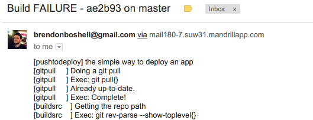

# pushtodeploy

`pushtodeploy` is a package which allows you to automatically deploy your Node.js application into your production or CI environment.

## What does it do?

**Builds a source copy**:

* It first runs `git pull` to get the latest changes on the server for the `master` (or other) branch.
* It clones the entire repo into `.pushtodeploy/<commit-hash>`.
* It copies the `node_modules` directory from the latest deployed version. This results in faster builds, but can be turned off if required.
* Symlinks any secrets that are not in the repo into the build directory. Your production machine might contain a file--say, secrets.js--that contain API keys, etc. These will be copied in before the build is performed.

**Builds the project and runs unit tests**:

* It simply calls `npm install` to install the package. Add stuff to your npm script to take control.
* It runs `npm test`.

**Deploys the build using symlink**

* It updates the `.pushtodeploy/current` symlink to point to `.pushtodeploy/<commit-hash>`.
* It runs `npm start`. This is your npm script responsible for starting your server, for example. It should return a value, see below.

**Can receive webhook events and send email updates**

* It can listen to Webhook events coming from your server (e.g. Bitbucket) which will fire off the automated deployment process.
* It will send you an email for every failed and successful deployment.

## How to use it

Firstly, install the package:

    `npm install pushtodeploy --save`

Then create a `pushtodeploy.json` config file, which looks something like this (without the comments):

    {
      "gitpull": {
        "enabled": true // true to git pull before build
      },
      "buildsrc": {
        "copyNodeModules": true, // true to copy node_modules from the latest build
        "secrets": [
          "../secrets.js" // array of secret files to copy over
        ]
      },
      "email": {
        "from": "from@example.com",
        "to": "to@example.com",
        "smtp": {
          "host": "smtp.mandrillapp.com",
          "port": 587,
          "auth": {
            "user": "from@example.com",
            "pass": "p@$$w0rd"
          }
        }
      }
    }

Now, add

    "deploy": "pushtodeploy --config pushtodeploy.json"

to `package.json`'s scripts:

    "scripts": {
      "deploy": "pushtodeploy --config pushtodeploy.json"
    }

You will also need to have a `start` script. This shouldn't block (i.e. it shouldn't be `node server.js`). It should do something like start a server, or migrate a database, and then return. I recommend using PM2 to start the app. This is an example:

    result=${PWD} && echo \"PWD: $result\" && cd .. && (pm2 reload testapp || pm2 start \"$result/server.js\" -i 4 --name testapp) && pm2 save

This script will change directory (there is a problem with symlinks resolving when inside), reload the application with no downtime (if it is already running) or start it if this the first time. It will also save the configuration.

Clone your repo onto your production server. Run

    npm run deploy

## More advanced stuff

### Receiving Webhooks

Perhaps you want to be automatically deploy whenever your remote is pushed to. This can be achieved using webhooks -- setting up a server which you can `POST` to. Whenever the server receives an event, it will simply re-run `npm deploy`.

Firstly, create a new script called `deploy-listen` as follows:

    "scripts": {
      "deploy-listen": "(pm2 stop deploylisten; pm2 start \"node_modules/.bin/pushtodeploy-listen --port 3123\" --name deploylisten) && pm2 save"
    }

You can run this using `npm run deploy-listen`. Or, you can build your own server
and call `npm deploy` according to some external stimulus.
